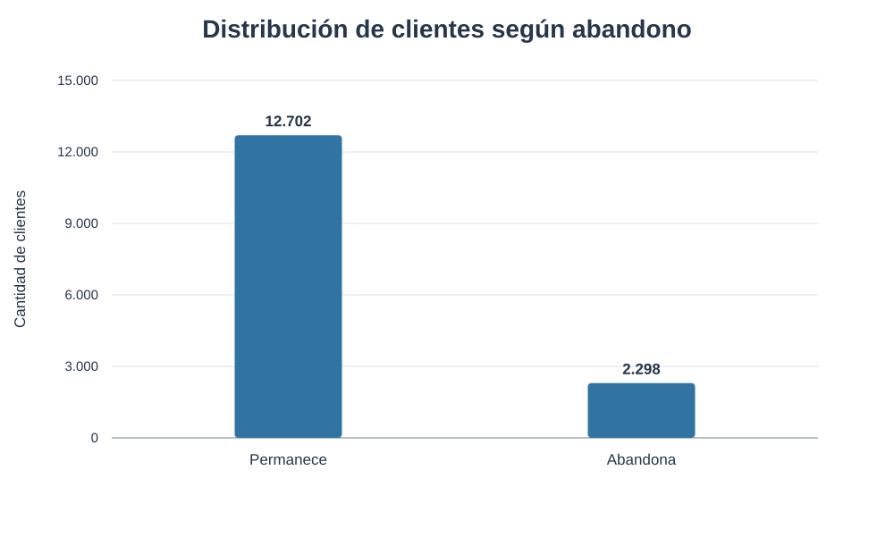
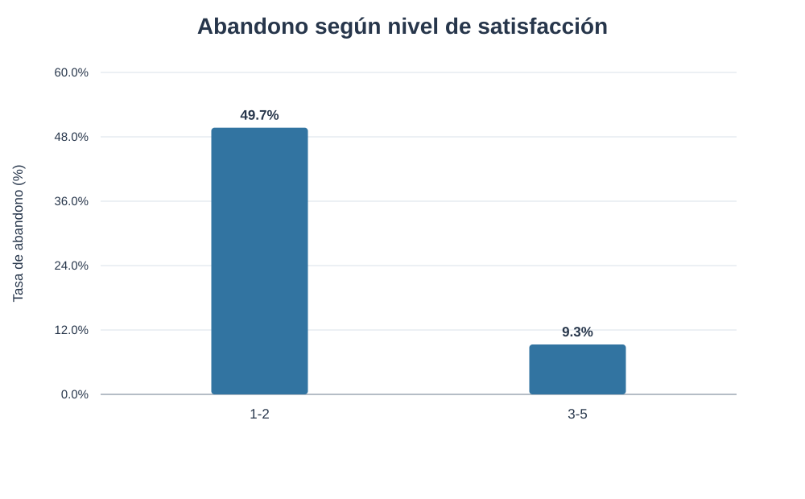
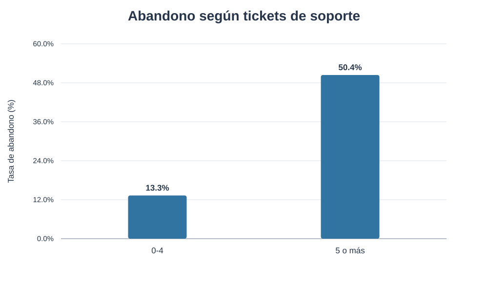
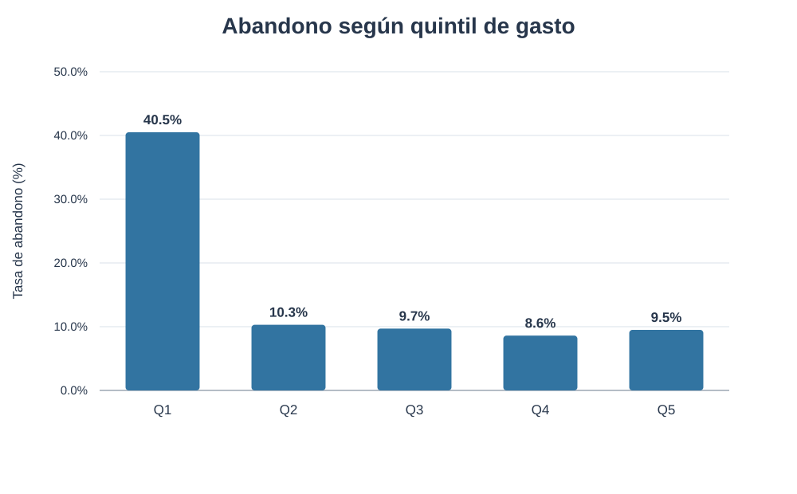
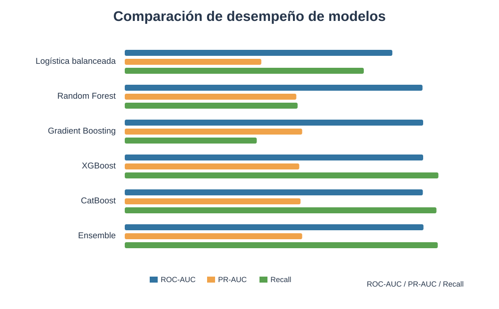
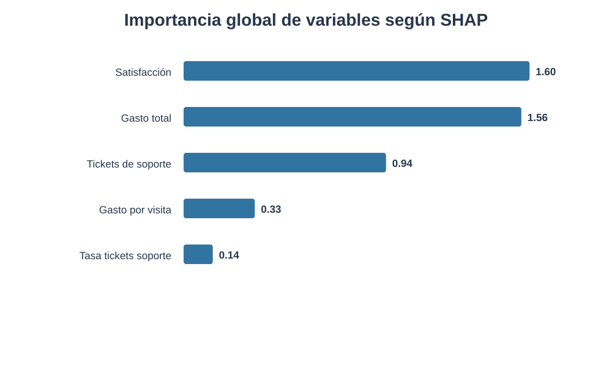
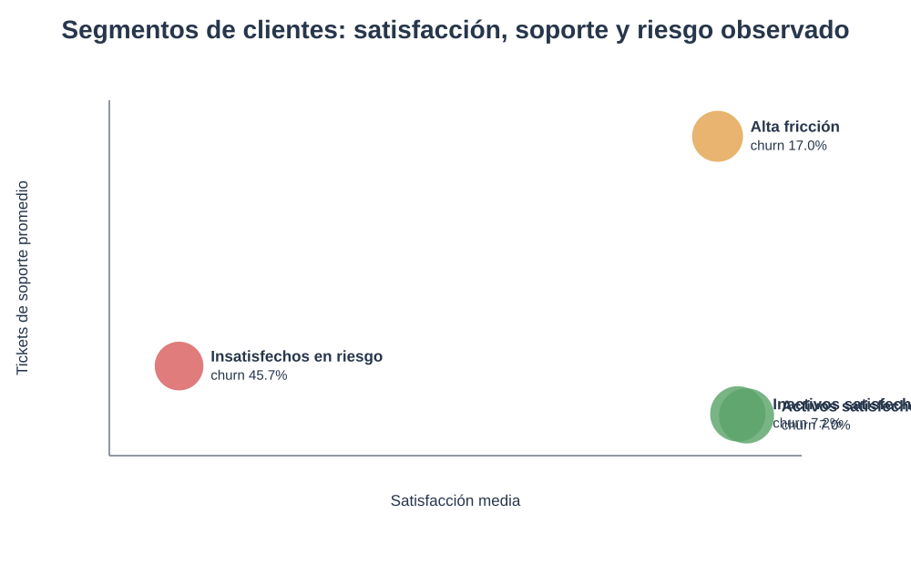
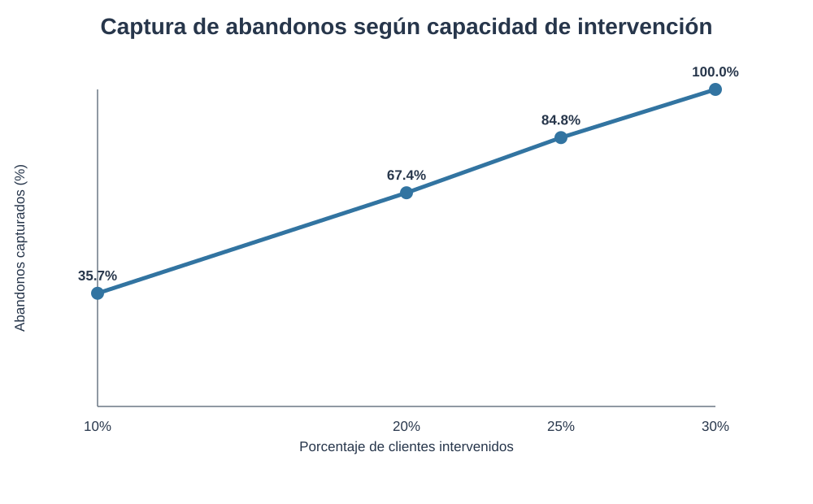

# Informe final - PPIV Proyecto Integrador 2026

## Inteligencia de Retención de Clientes

**Carrera:** Ciencia de Datos e Inteligencia Artificial  
**Proyecto:** PPIV - Proyecto Integrador 2026  
**Autora:** Fernanda Fava

## 1. Contexto y problema de negocio

El proyecto se plantea desde la perspectiva de un equipo de analistas de datos de un negocio de comercio electrónico. El objetivo es comprender el comportamiento de los clientes, detectar patrones asociados al abandono y convertir los resultados en recomendaciones concretas de retención.

La variable objetivo es `churn`: indica si un cliente abandona o permanece. El análisis parte de un dataset de **15.000 clientes y 30 variables originales** vinculadas con comportamiento de compra, marketing y engagement, satisfacción, soporte, navegación, valor económico y características demográficas y temporales.

La tasa observada de abandono es de aproximadamente **15,3%**, por lo que el problema presenta desbalance de clases.



## 2. Obtención, auditoría y calidad del dataset

La consigna requería trabajar con un dataset que no estuviera impecable. La auditoría inicial identificó:

- valores faltantes;
- edades inválidas;
- inconsistencias temporales;
- combinaciones geográficas poco confiables;
- variables con posible riesgo de fuga de información;
- desbalance de clases.

No se aplicaron correcciones arbitrarias a relaciones geográficas sin una fuente autoritativa. Las decisiones de limpieza se documentaron y se mantuvo trazabilidad sobre qué campos podían utilizarse en modelado.

### Prevención de data leakage

- El split se realiza antes del preprocesamiento.
- La imputación se ajusta solamente con train.
- Se excluyen identificadores.
- Se revisan variables potencialmente posteriores al evento objetivo.
- La calibración utiliza un conjunto separado del test final.

## 3. Limpieza y preprocesamiento

El flujo de preparación incluye reglas de validación, tratamiento de faltantes dentro del pipeline, conversión de tipos, selección de variables y generación de variables derivadas.

El objetivo fue que el procesamiento pudiera repetirse de forma consistente sobre datos nuevos. La estructura se implementó en notebooks y scripts reproducibles, con separación entre desarrollo analítico, artefactos de aplicación y código reutilizable.

## 4. Estadística descriptiva y análisis exploratorio

El EDA se utilizó para comprender distribuciones, detectar comportamientos anómalos y observar relaciones preliminares con churn.

Tres variables mostraron patrones especialmente claros:

- satisfacción;
- tickets de soporte;
- gasto.

Estas señales se analizaron luego formalmente mediante hipótesis y también reaparecieron en los modelos y en la explicabilidad SHAP.

## 5. Tres hipótesis

### H1 - Baja satisfacción y abandono

Los clientes con satisfacción baja presentan una tasa de abandono de aproximadamente **49,7%**, frente a **9,3%** en el grupo de referencia.

- Riesgo relativo: **5,33x**
- V de Cramér: **0,402**



### H2 - Fricción de soporte y abandono

Los clientes con 5 o más tickets de soporte presentan una tasa de abandono aproximada de **50,4%**, frente a **13,3%** entre quienes tienen entre 0 y 4 tickets.

- Riesgo relativo: **3,79x**
- V de Cramér: **0,232**



### H3 - Bajo gasto y abandono

El quintil inferior de gasto presenta una tasa de abandono aproximada de **40,5%**, mientras que los quintiles superiores se mantienen alrededor del 9-10%.

- Riesgo relativo: **4,25x**
- V de Cramér: **0,340**



Los resultados se interpretan como **asociaciones estadísticas**, no como evidencia causal.

## 6. Insights del análisis

Los hallazgos convergen en una lectura de negocio consistente: la insatisfacción, la fricción de soporte y el menor gasto están asociados con mayor abandono.

Esto permite orientar acciones hacia clientes donde existe una señal observable y potencialmente accionable.

Las recomendaciones preliminares son:

- recuperación de experiencia para clientes insatisfechos;
- escalamiento y seguimiento para alta fricción de soporte;
- reactivación personalizada para clientes inactivos;
- fidelización preventiva para clientes valiosos con riesgo creciente.

## 7. Modelos predictivos

Se implementaron y compararon:

- DummyClassifier;
- Regresión Logística;
- Regresión Logística balanceada;
- Random Forest;
- Gradient Boosting;
- XGBoost;
- XGBoost optimizado;
- CatBoost;
- ensemble de Gradient Boosting + XGBoost + CatBoost.

Dado el desbalance, la evaluación no se basó solamente en accuracy. Se utilizaron recall, precision, F1, balanced accuracy, ROC-AUC, PR-AUC y matriz de confusión.

El DummyClassifier muestra por qué accuracy puede ser engañosa: logra una exactitud alta por la clase mayoritaria pero detecta 0% de los abandonos.



El ensemble alcanzó aproximadamente:

- **ROC-AUC: 0,921**
- **PR-AUC: 0,547**
- **Recall: 96,5%**
- **F1: 0,675**

## 8. Explicabilidad del modelo

Se utilizó SHAP para comprender la contribución de las variables tanto a nivel global como individual.

Las variables más relevantes fueron:

- satisfacción;
- gasto total;
- tickets de soporte;
- gasto por visita;
- tasa de tickets de soporte.



SHAP permite entender qué variables aumentan o reducen el riesgo estimado para cada cliente.

## 9. Segmentación no supervisada

Se implementó clustering sin utilizar `churn` para crear los grupos.

Se identificaron cuatro perfiles:

- Insatisfechos en riesgo;
- Alta fricción de soporte;
- Inactivos satisfechos;
- Activos satisfechos.

La tasa de abandono se observó luego de formar los clusters para interpretar sus perfiles. La estabilidad entre semillas presentó un **Adjusted Rand Index promedio superior a 0,96**.



El clustering no reemplaza al modelo de churn: agrega contexto para diferenciar estrategias de intervención.

## 10. Priorización, calibración y decisión de negocio

El proyecto incorpora un puntaje operativo que combina:

- 65% riesgo de abandono;
- 25% valor comercial;
- 10% riesgo del segmento.

También se compararon probabilidades sin calibrar, Platt scaling e isotonic regression.

Resultados principales:

- Brier Score sin calibrar: **0,1039**
- Brier Score con Platt: **0,0755**
- ECE sin calibrar: **0,1062**
- ECE con Platt: **0,0098**
- ROC-AUC: **0,9184** antes y después de Platt

La calibración mejora la interpretación probabilística sin modificar sustancialmente el ranking.

La política final no utiliza un umbral universal de 0,50. En cambio, permite decidir cuántos clientes intervenir según presupuesto y capacidad.



Sobre el conjunto de test:

- Top 10% captura aproximadamente **35,7%** de los abandonos.
- Top 20% captura aproximadamente **67,4%**.
- Top 25% captura aproximadamente **84,8%**.
- Top 30% alcanza **100%** en ese conjunto.

**Principio de negocio:** el modelo estima riesgo; la política de negocio decide cuántos clientes intervenir.

## 11. Visualización e integración con Python

La solución final se integró en una aplicación **Streamlit** desarrollada en Python y desplegada en Streamlit Community Cloud.

Aplicación:

https://ppivproyectointegrador2026-3nmnzhsbpyrbvub9rtrwoc.streamlit.app/

Incluye:

- resumen ejecutivo;
- riesgo y priorización;
- desempeño de modelos;
- IA explicable;
- segmentación;
- hipótesis e insights;
- calidad de datos y EDA;
- predicción individual en vivo;
- scoring masivo por CSV;
- calibración;
- simulación de capacidad operativa.

Esta integración responde directamente a la consigna de conectar el desarrollo en Python con una herramienta de visualización.

## 12. Conclusiones y recomendaciones

El proyecto demuestra que una solución de churn útil requiere más que un clasificador con buenas métricas.

Los principales aprendizajes son:

1. La calidad del dato condiciona todo el análisis.
2. El desbalance obliga a seleccionar métricas adecuadas.
3. La explicabilidad permite convertir una predicción en una herramienta más confiable.
4. El clustering aporta contexto para diferenciar acciones.
5. La calibración mejora la lectura de las probabilidades.
6. La decisión final debe considerar capacidad, costo y estrategia.
7. El mayor valor aparece al integrar predicción, explicación y priorización.

El **20% de clientes con mayor prioridad concentra alrededor del 69,6% de los abandonos reales** en la evaluación del ranking, lo que evidencia una oportunidad concreta para focalizar recursos.

## 13. Limitaciones y próximos pasos

- El dataset no representa necesariamente una empresa real específica.
- Las asociaciones observadas no implican causalidad.
- No se incorporaron costos reales de campañas o incentivos.
- La política óptima debería recalibrarse con datos productivos.
- El monitoreo de drift todavía no está implementado.
- Las explicaciones contrafactuales quedan como extensión futura.

Como próximos pasos se podrían incorporar costos y beneficio esperado, monitoreo de drift, reentrenamiento periódico, contrafactuales y experimentos A/B.

## 14. Reproducibilidad y archivos fuente

El repositorio incluye notebooks, scripts, documentación, snapshots analíticos, modelo operativo y aplicación.

El dataset crudo y ciertos artefactos locales no se versionan; las carpetas reservadas se conservan mediante `.gitkeep`.

Ejecución local:

```bash
git clone https://github.com/ferfava/PPIV_Proyecto_Integrador_2026.git
cd PPIV_Proyecto_Integrador_2026
pip install -r requirements.txt
streamlit run app/streamlit_app.py
```

**Repositorio:** https://github.com/ferfava/PPIV_Proyecto_Integrador_2026
